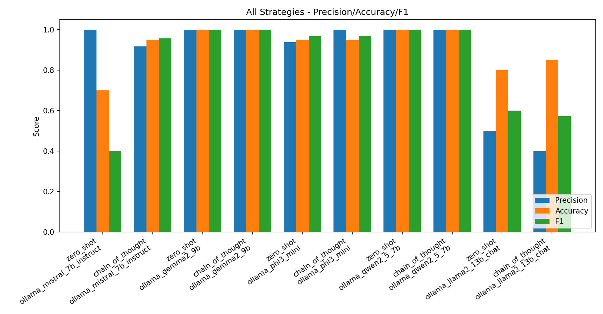
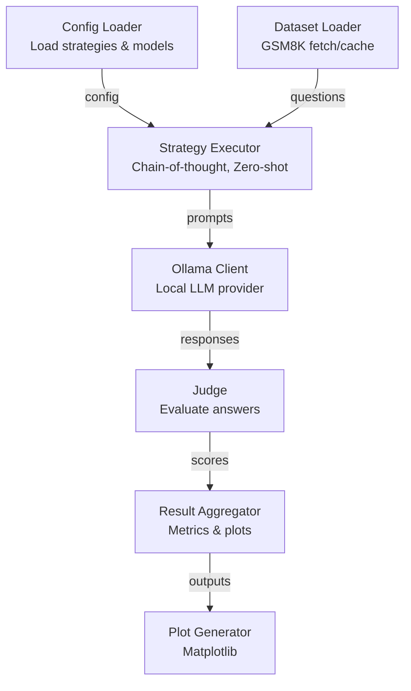

# Prompt Engineering for Research Ollama Based

This repository runs a prompt-engineering experiment on GSM8K with local-first and optional automatic remote retrieval.

- Generation provider: Ollama only
- Judge provider: Ollama only
- Dataset source: local snapshot, or automatic Hugging Face retrieval

## Results

**Does prompt engineering improve GSM8K final-answer accuracy?** Yes — switching from a
plain `zero_shot` prompt (the **baseline**) to `chain_of_thought` lifts exact-match accuracy
by **+17 percentage points on average** across five local Ollama models (**4 of 5 models improve**).



_Dataset: GSM8K · 20 questions per cell · exact-match final-answer accuracy · baseline = `zero_shot` · generated by `scripts/aggregate_results.py`._

| Model | zero_shot (baseline) | chain_of_thought | Δ best vs baseline |
| --- | --- | --- | --- |
| phi3:mini | 75% | 85% | +10% |
| qwen2.5:7b | 60% | 95% | +35% |
| gemma2:9b | 55% | 90% | +35% |
| mistral:7b-instruct | 40% | 55% | +15% |
| llama2:13b-chat | 20% | 10% | -10% |
| **Mean** | **50%** | **67%** | **+17%** |

**Key findings**

- **Chain-of-thought is a clear win** for capable small/mid models: `qwen2.5:7b` and `gemma2:9b`
  jump +35 points each, reaching 95% and 90%.
- **It is not universal:** `llama2:13b-chat` *regresses* (20% → 10%) — it tends to ramble and
  drop the final numeric answer, so larger ≠ better here.
- **Latency cost is modest** for most models (~5–9 s/question), the notable exception being
  `llama2:13b-chat` (~20–27 s). Full per-cell latency is in [`results/summary.csv`](results/summary.csv).
- **Caveat:** each cell is only **n = 20** questions, so treat these as directional, not final.
  Re-run with `--sample-size 500` for a tighter estimate (see [Run](#run)).

**Reproduce the table**

```bash
python scripts/aggregate_results.py   # reads results/runs/** -> results/summary.csv + summary.md
```

Confusion matrices per model/strategy are in `results/runs/plots/`.

## Current Scope

- Compare prompt strategies on a fixed local model setup
- Parse final answers and evaluate exact-match correctness
- Optionally run a local judge model for rubric-based scoring
- Run a dedicated llama3.1 confusion checker for TP/TN/FP/FN analysis
- Export structured outputs for analysis

## Requirements

- Python virtual environment in this workspace
- Ollama running locally
- Models pulled in Ollama for generation and judge (current config uses llama3.1:8b)
- Local snapshot file at data/raw/gsm8k_snapshot.jsonl (auto-fetch can populate or expand it)

## Configuration

Primary config file:

- config/experiment.json

Quick local profile:

- config/experiment-gemini.json

Despite its filename, config/experiment-gemini.json is now a local-only quick profile.

## Environment Variables

Supported local env variables are defined in .env.example:

- EXPERIMENT_CONFIG_PATH
- OLLAMA_BASE_URL
- OLLAMA_REQUEST_INTERVAL_SECONDS
- OLLAMA_JUDGE_REQUEST_INTERVAL_SECONDS
- OLLAMA_RETRY_BACKOFF_SECONDS
- OLLAMA_MAX_RETRY_BACKOFF_SECONDS
- OLLAMA_JUDGE_RETRY_BACKOFF_SECONDS
- OLLAMA_JUDGE_MAX_RETRY_BACKOFF_SECONDS
- OLLAMA_NUM_GPU
- OLLAMA_DEVICES
- OLLAMA_DEBUG
- OLLAMA_GENERATION_BUCKET
- OLLAMA_JUDGE_BUCKET

Precedence order:

1. CLI arguments
2. Config file values
3. Environment fallback values
4. Code defaults

## Run

From repository root:

```powershell
& "c:/Users/Drew/Desktop/Prompt Engineering for Research Ollama Based/.venv/bin/python.exe" -m src.main --config config/experiment.json
```

Useful runtime flags:

- `--dataset-source local|auto|remote`
- `--dataset-split test|train`
- `--snapshot-path <path-to-gsm8k-jsonl>`
- `--sample-size <int>`
- `--num-tests <int>` (alias for `--sample-size`)
- `--interactive-num-tests` (prompts for test count at runtime)
- `--interactive-dataset-source` (prompts at startup when source not provided)
- `--storage` (deprecated; JSON/JSONL outputs are always used)

Examples:

```powershell
# Auto-fetch enough GSM8K rows for a larger run
& ".venv/Scripts/python.exe" -m src.main --config config/experiment.json --dataset-source auto --sample-size 500

# Force remote retrieval and prompt for mode if omitted
& ".venv/Scripts/python.exe" -m src.main --config config/experiment.json --interactive-dataset-source

# Prompt for test count at runtime and use a custom snapshot file
& ".venv/Scripts/python.exe" -m src.main --config config/experiment.json --interactive-num-tests --snapshot-path data/raw/gsm8k_snapshot.jsonl
```

## One-Click Scripts

These scripts automate local setup and execution:

- Install Ollama if missing
- Start Ollama server
- Pull the required model
- Create virtual environment
- Install Python dependencies if present
- Create .env from .env.example if missing
- Run the experiment

Windows PowerShell:

```powershell
pwsh -ExecutionPolicy Bypass -File scripts/one_click_windows.ps1
```

Linux:

```bash
bash scripts/one_click_linux.sh
```

Optional arguments:

- Windows: `-ConfigPath config/experiment.json -ModelNames llama3.1:8b,deepseek-coder-v2 -SkipRun`
- Linux: `--config config/experiment.json --model llama3.1:8b --skip-run`
- Windows pass-through to main CLI: `-MainArgs @("--dataset-source","auto","--sample-size","500")`

Windows behavior notes:

- Pulls all Ollama models listed under `models[]` where `provider` is `ollama`
- Also pulls Ollama judge model when `judge.enabled=true` and `judge.provider=ollama`
- You can add extra pulls via `-ModelName` (single) or `-ModelNames` (multiple)
- If `OLLAMA_NUM_GPU` is not set, the script defaults it to `999` before starting `ollama serve`

GPU tips:

- Set `OLLAMA_NUM_GPU=999` to prefer maximum layer offload on GPU
- Set `OLLAMA_DEVICES` to pin specific GPU devices on multi-GPU systems
- Set `OLLAMA_DEBUG=1` for device/backend diagnostics while troubleshooting

Run a single model:

```powershell
& "c:/Users/Drew/Desktop/Prompt Engineering for Research Ollama Based/.venv/bin/python.exe" -m src.main --config config/experiment.json --model ollama_main
```

Run a single strategy:

```powershell
& "c:/Users/Drew/Desktop/Prompt Engineering for Research Ollama Based/.venv/bin/python.exe" -m src.main --config config/experiment.json --strategy zero_shot
```

## Outputs

Outputs are JSON/JSONL artifacts:

- results/runs/local_parsed_answers.json
- results/runs/local_metrics_summary.json
- results/runs/local_confusion_matrices.json
- results/runs/local_quantitative_summary.json
- results/runs/local_quantitative_details.json
- results/runs/local_run_metadata.json
- results/runs/by_strategy/<strategy>/<model_id>/raw_generations.jsonl
- results/runs/by_strategy/<strategy>/<model_id>/parsed_answers.json
- results/runs/by_strategy/<strategy>/<model_id>/metrics_summary.json
- results/runs/by_strategy/<strategy>/<model_id>/confusion_matrices.json
- results/runs/by_strategy/<strategy>/<model_id>/quantitative_summary.json
- results/runs/by_strategy/<strategy>/<model_id>/quantitative_details.json

## Notes

- Non-ollama providers fail fast by design in local-only mode.
- Dataset retrieval supports local snapshot and automatic Hugging Face download (via `datasets`).
- Successful rows are skipped on reruns based on parsed output state.


## Architecture (UML)


